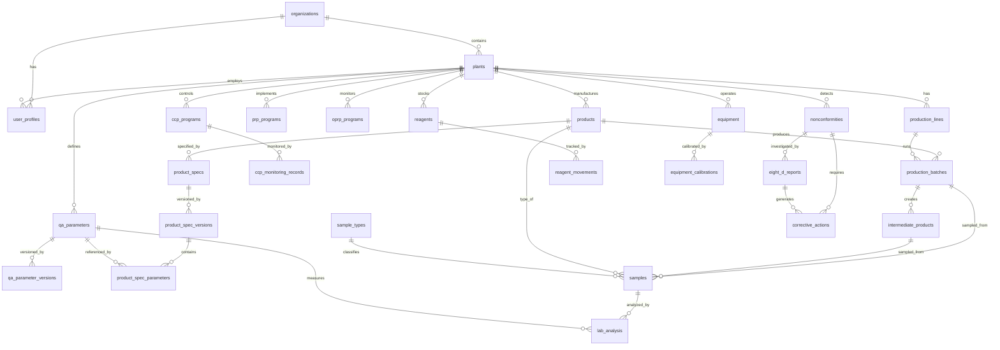

# SmartLab v4 — Data Model Documentation

**Version**: 1.0  
**Date**: 2025-11-26  
**Status**: Phase 1 Complete

---

## Architecture Overview

SmartLab v4 implements a **multi-tenant, plant-level customizable** data model with:
- **Row Level Security (RLS)** on every table
- **Tenant isolation** via `organization_id` 
- **Plant-level customization** via `plant_id`
- **Comprehensive audit trail** for all data changes
- **Versioning** for specifications and parameters
- **Soft deletes** (status = 'obsolete') instead of hard deletes

---

## Database Schema Diagram



---

## Core Tables

### 1. Multi-Tenancy Core

#### `organizations`
Root tenant entity. Each organization can have multiple plants.

| Column | Type | Description |
|--------|------|-------------|
| id | UUID | Primary key |
| name | TEXT | Organization name |
| slug | TEXT | Unique URL-safe identifier |
| plan | ENUM | Subscription plan (trial, starter, pro, enterprise) |
| created_at | TIMESTAMPTZ | Creation timestamp |
| updated_at | TIMESTAMPTZ | Last update timestamp |

**RLS Policy**: Users see only their own organization via JWT `organization_id`

#### `plants`
Factory/facility within an organization.

| Column | Type | Description |
|--------|------|-------------|
| id | UUID | Primary key |
| organization_id | UUID | FK to organizations |
| name | TEXT | Plant name |
| code | TEXT | Unique plant code (per tenant) |
| address | JSONB | Physical address |
| timezone | TEXT | Plant timezone |

**RLS Policy**: Accessible only to users in the same `organization_id`

**Unique Constraint**: `(organization_id, code)`

#### `user_profiles`
Extends Supabase `auth.users` with tenant/plant/role information.

| Column | Type | Description |
|--------|------|-------------|
| id | UUID | PK, FK to auth.users |
| organization_id | UUID | FK to organizations |
| plant_id | UUID | FK to plants (nullable) |
| role | user_role | RBAC role (admin, qa_supervisor, lab_tech, etc.) |
| full_name | TEXT | User's full name |
| employee_id | TEXT | Employee identifier |

**Roles**: `admin`, `qa_supervisor`, `lab_tech`, `auditor`, `plant_manager`, `viewer`

**RLS Policy**: Users see profiles in their tenant; admins can manage all

#### `audit_logs`
Immutable audit trail for all table changes.

| Column | Type | Description |
|--------|------|-------------|
| id | UUID | Primary key |
| organization_id | UUID | FK to organizations |
| user_id | UUID | FK to auth.users |
| table_name | TEXT | Name of modified table |
| record_id | UUID | ID of modified record |
| action | TEXT | INSERT, UPDATE, or DELETE |
| old_data | JSONB | State before change |
| new_data | JSONB | State after change |
| ip_address | INET | Client IP |
| user_agent | TEXT | Client user agent |

**RLS Policy**: Read-only access to users in same tenant

---

## Production Module

### `production_lines`
Production lines per plant.

**Tenant/Plant**: ✅ Both  
**Status**: `active`, `inactive`, `maintenance`  
**Unique**: `(plant_id, code)`

### `products`
Products manufactured at each plant.

**Tenant/Plant**: ✅ Both  
**Status**: `active`, `obsolete` (soft delete)  
**Unique**: `(plant_id, sku)`

### `production_batches`
Parent production batch (represents the Final Product run).

**Hierarchy**: Root → `intermediate_products`  
**Status**: `open`, `closed`, `blocked`  
**Unique**: `(plant_id, code)`

### `intermediate_products`
Intermediate products (syrup, mix, base) used in Tanks.

**Parent**: `production_batches`  
**Status**: `pending`, `approved`, `rejected`, `in_use`  
**Unique**: `(production_batch_id, code)`

### `intermediate_ingredients`
Raw materials consumed by an intermediate product.

**Parents**: `intermediate_products`, `raw_material_lots`  
**Columns**: `quantity`, `unit`, `added_at`  
**Unique**: `(intermediate_product_id, raw_material_lot_id)`


---

## Laboratory (LIMS)

### `qa_parameters` + `qa_parameter_versions`
Versioned QA parameters per plant.

**Versioning Pattern**:
- `qa_parameters`: Master record with current status
- `qa_parameter_versions`: Historical versions with `is_current` flag
- Helper function: `get_current_parameter_version(p_parameter_id)`

**Types**: `numeric`, `text`, `boolean`, `list`, `file` (stores URL to Supabase Storage)  
**Categories**: `physico-chemical`, `microbiology`, `sensory`  
**Status**: `active`, `obsolete`

### `sample_types`
Lookup table for sample classifications.

**Standard Types**:
- Raw Material
- Water
- Intermediate Product
- Finished Product
- Food Contact Surface
- Environmental

### `samples`
Samples collected for analysis.

**Status Pipeline**: `pending` → `in_analysis` → `reviewed` → `approved`/`rejected`  
**Priority**: `low`, `normal`, `high`, `urgent`

### `lab_analysis`
Individual parameter test results.

**Spec Snapshot**: Stores specification limits at time of analysis (JSONB)  
**Conformity**: Auto-calculated `is_conforming` flag  
**Review**: Two-step process (analyst → reviewer)
**Signature**: `signed_transaction_hash` (UUID/TEXT) for 21 CFR Part 11 compliance

---

## Product Specifications

### `product_specs` + `product_spec_versions` + `product_spec_parameters`
Versioned product specifications with parameter limits.

**Three-Level Structure**:
1. `product_specs`: Header (which product)
2. `product_spec_versions`: Version control (effective_from, is_current)
3. `product_spec_parameters`: Parameter limits per version

**Helper Function**: `get_current_product_spec(p_product_id)` (Returns strict `is_current: true` record for MVP validation)

**Versioning Workflow**:
1. Create new version when specs change
2. Mark previous version `is_current = false`
3. Approve new version
4. System uses current version for validation

---

## Food Safety Management System (FSMS)

### `prp_programs`
Prerequisite Programs (foundation layer).

**Categories**: infrastructure, hygiene, pest_control, waste, training  
**Frequency**: daily, weekly, monthly, quarterly

### `oprp_programs`
Operational Prerequisite Programs (operational controls).

**Hazard-specific**: Each OPRP targets specific hazards  
**Control Limits**: Stored as JSONB for flexibility

### `ccp_programs`
Critical Control Points (critical layer).

**Hazard Types**: `biological`, `chemical`, `physical`  
**Critical Limits**: JSONB structure (e.g., temperature ranges)  
**Unique**: `(plant_id, ccp_number)`

### `ccp_monitoring_records`
Real-time CCP monitoring records.

**Deviation Tracking**: `is_within_limits` flag  
**Corrective Actions**: Immediate documentation required  
**Indexed**: Fast queries for non-conforming records

---

## Quality Management System (QMS)

### `nonconformities`
NC register per plant.

**Severity**: `critical`, `major`, `minor`  
**Sources**: lab_analysis, audit, customer_complaint, internal, supplier, ccp_monitoring  
**Status Flow**: `open` → `investigating` → `action_taken` → `closed`

### `eight_d_reports`
8 Disciplines problem-solving methodology.

**Disciplines**:
- D1: Team formation
- D2: Problem description
- D3: Containment actions
- D4: Root cause analysis (includes 5 Whys)
- D5: Corrective actions
- D6: Implementation
- D7: Prevention
- D8: Validation & recognition

**One-to-One**: Each NC can have one 8D report
**Signature**: `signed_transaction_hash` (UUID/TEXT) for compliance

### `corrective_actions`
CAPA (Corrective and Preventive Actions).

**Status**: `pending`, `in_progress`, `completed`, `verified`, `cancelled`  
**Links**: Can link to NC and/or 8D report  
**Due Dates**: Trackable with responsible user assignment

---

## Reagents & Equipment

### `reagents` + `reagent_movements`
Movement-based inventory system.

**Movement Types**: `in`, `out`, `adjustment`  
**Current Stock**: Calculated via `get_reagent_current_stock(p_reagent_id)`  
**No Direct Stock Field**: Prevents drift, ensures auditability

### `equipment` + `equipment_calibrations`
Equipment calibration management.

**Auto-Calculated Status**: Generated column for `calibration_status`
- `not_calibrated`
- `overdue`
- `due_soon` (within 30 days)
- `current`

**Auto-Update**: Trigger updates `last_calibrated_at` and `next_calibration_due` after calibration

---

## RLS Security Model

Every table follows this pattern:

```sql
-- Enable RLS
ALTER TABLE table_name ENABLE ROW LEVEL SECURITY;

-- Tenant isolation policy
CREATE POLICY "allow_access_if_same_tenant" ON table_name
  FOR ALL USING (organization_id = (auth.jwt() ->> 'organization_id')::uuid);
```

**JWT Requirements**:
- `organization_id`: Organization UUID
- `plant_id`: Current plant UUID (optional)
- `role`: User role for RBAC

**Policy Hierarchy**:
1. Tenant-level tables: Direct `organization_id` check
2. Nested tables: Subquery to parent table with `organization_id`

---

## Audit Trail

**Automatic**: All tables have audit triggers  
**Trigger Function**: `audit_trigger_func()` (generic, reusable)  
**Captures**: Old state, new state, user, timestamp, IP  
**Immutable**: Audit logs cannot be modified or deleted

---

## Naming Conventions

- **Tables**: snake_case, plural (e.g., `production_lots`)
- **Columns**: snake_case (e.g., `created_at`)
- **Enums**: snake_case (e.g., `user_role`)
- **Functions**: snake_case with verb (e.g., `get_current_parameter_version`)
- **Indexes**: `idx_table_column` pattern
- **Policies**: Descriptive names (e.g., `allow_access_if_same_tenant`)
- **Triggers**: `audit_` or `update_` prefix

---

## Safety Constraints (Bulletproof Levels)

To satisfy "Fail-proof" requirements, the following constraints MUST be implemented in SQL:

1.  **Logical Range Checks**:
    - `CHECK (min_value <= max_value)` on specifications
    - `CHECK (min_value <= target_value AND target_value <= max_value)`

2.  **Orphan Prevention**:
    - `ON DELETE RESTRICT` for all structural foreign keys (Organization, Plant, Product, Parameter).
    - **Reason**: You cannot delete a Product if it has Production Batches.

3.  **Data Completeness**:
    - `NOT NULL` on all critical discriminators (`organization_id`, `plant_id`, `code`, `status`).

4.  **No Magic Strings**:
    - Use PostgreSQL `ENUM` types for all statuses.

---

## Migration Strategy

**File Naming**: `YYYYMMDDHHMMSS_description.sql`

**Order**:
1. `001_core_tenancy.sql` - Organizations, plants
2. `002_auth_roles.sql` - User profiles, roles
3. `003_audit_trail.sql` - Audit logging
4. `004_production_core.sql` - Production hierarchy (Batches, Intermediate)
5. `005_lab_core.sql` - LIMS tables
6. `006_product_specs.sql` - Specifications engine
7. `007_fsms_core.sql` - HACCP (PRP/OPRP/CCP)
8. `008_qms_core.sql` - NC/8D/CAPA
9. `009_reagents_equipment.sql` - Inventory and calibration

**Apply Order**: Sequential (dependencies enforced)

---

## Next Phase

Phase 2 will add:
- TypeScript server actions for CRUD operations
- Frontend UI components
- Real-time subscriptions
- Auth flows

**This data model is production-ready and compliant with:**
- ✅ ISO 9001:2015 (QMS)
- ✅ ISO 22000 (FSMS)
- ✅ FSSC 22000 (Food Safety)
- ✅ HACCP (CCP/OPRP/PRP)
- ✅ 21 CFR Part 11 (Audit trail)
