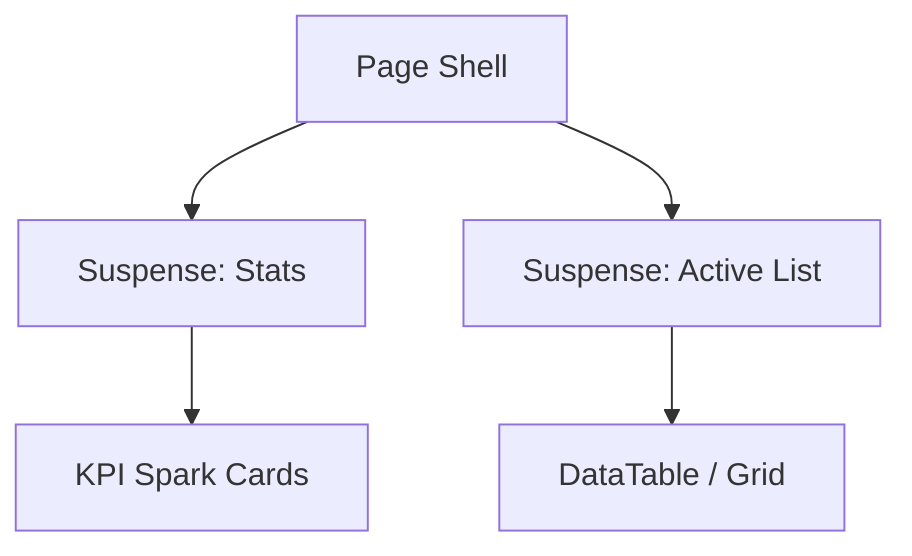

# Performance Design: TanStack & Streaming Bridge

## 🏗️ Architecture Design

### 1. Global Query Provider
Localizado em `src/providers/query-provider.tsx`. 
- **StaleTime**: 1 minuto para dados industriais críticos (Lotes, Análises).
- **GcTime**: 5 minutos.
- **Prefetching**: Ativar `prefetchQuery` em eventos de `onMouseEnter` nos links de navegação.

### 2. Hydration Bridge
Utilizar o padrão de "Hydration" do Next.js 15:
- O Servidor executa a query via `prefetchQuery`.
- O estado é serializado e passado para o Cliente via `HydrationBoundary`.
- O Cliente assume o controlo dos dados sem "flicker" ou re-fetch imediato.

### 3. Progressive Content Streaming
Fragmentação das páginas core:

## 🚀 Performance Targets
| Metric | Current (Est.) | Target |
| --- | --- | --- |
| Page Transition | ~1500ms | < 200ms |
| First Contentful Paint | ~1200ms | < 400ms |
| Data Freshness | On-load | Real-time / Background |

## 🔗 Dependencies
- `@tanstack/react-query`: v5.90+
- `next-safe-action`: For optimized mutations
- `nuqs`: For URL-state synchronization without full reloads
